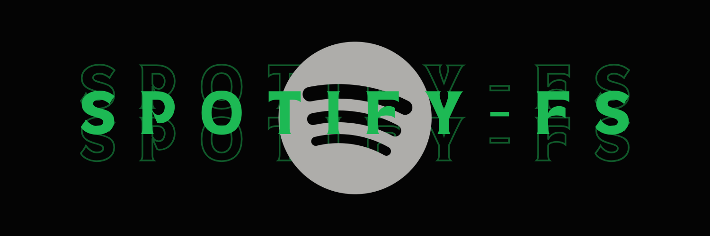

**spotify-fs** is a Proof of Concept (PoC) tool written in Go that allows you to store arbitrary files inside Spotify playlists. 

It works by transforming binary data into a sequence of Spotify tracks. Essentially, it maps byte values (0-255) to specific songs and arranges them in a playlist to represent the file.

> ⚠️ **DISCLAIMER:** This project is for educational and research purposes only. Storing data in playlists likely violates Spotify's Terms of Service. The author is not responsible for banned accounts or data loss. Use at your own risk.

## 🚀 Features

- **Encrypted/Seeded Mapping:** Uses a password to generate a unique dictionary mapping bytes to tracks. Without the password (and the generated decoder map), the playlist just looks like a random collection of songs.
- **Chunking & Chaining:** Automatically splits large files across multiple playlists if they exceed the track limit. Playlists are linked together via their description fields.
- **Concurrency:** Uses multiple workers to speed up the writing (adding tracks) and reading (fetching tracks) processes.
- **Rate Limit Handling:** Automatically backs off and retries when hitting Spotify API rate limits (429) or gateway errors (502).

## 🛠️ Prerequisites

- **Go**: Version 1.25 or higher.
- **Spotify Account**: Required for API access to modify playlists effectively.
- **Spotify Developer Application**: You need a Client ID and Client Secret.

## ⚙️ Setup

### 1. **Clone the repository:**
   ```bash
   git clone [https://github.com/xelckis/spotify-fs.git](https://github.com/xelckis/spotify-fs.git)
   cd spotify-fs
   ```

### 2. Create a Spotify App:
   - Go to the Spotify Developer Dashboard.
   - Create an app and set the Redirect URI to: http://127.0.0.1:8080/callback/spotify

### 3. Set Environment Variables: You must export your credentials before running the tool:

Linux/macOS:
```bash
export SPOTIFY_CLIENTID="your_client_id_here"
export SPOTIFY_CLIENTSECRET="your_client_secret_here"
```
Windows (PowerShell):
```PowerShell
$env:SPOTIFY_CLIENTID="your_client_id_here"
$env:SPOTIFY_CLIENTSECRET="your_client_secret_here"
```
## 📦 Usage

Run the application:
```bash
go run main.go
```
Follow the on-screen interactive prompts.

### 1. Writing a File (Upload)

Select option 1.

  1. Filepath: Path to the file you want to upload.

  2. Playlist Name: The base name for the playlist(s).

  3. Password: Used to seed the random generation of the byte-to-track dictionary.

   The tool will:

  - Authenticate via your browser.

  - Create a [PlaylistName]_Decoder.gob file locally (keep this safe! It helps speed up reading).

  - Upload the data to Spotify.

### 2. Reading a File (Download)

Select option 2.

  1. Playlist ID: The ID of the first playlist in the chain (found in the Spotify URL).

  2. Output Filename: Name (including extension) to save the restored file.

  3. Decoder Path (Optional): Path to the _Decoder.gob file generated during upload. If skipped, the tool attempts to regenerate the map using the password (slower).

  4. Password: Must match the one used during upload.

## 🔧 Technical Details

  - Dictionary Generation: The tool searches Spotify for random tracks based on a seed derived from your password. It assigns a unique Track URI to every byte value (0x00 to 0xFF).

  - Storage: The file is read in chunks. Each byte is converted to its corresponding Track URI and added to a playlist.

  - Linked List: If a file is too large for one playlist, a new one is created. The ID of the next playlist is stored in the description of the current playlist, forming a linked list.

# 

**youtube-fs** is a Proof of Concept (PoC) tool written in Go that allows you to store arbitrary files inside YouTube playlists.

> ⚠️ **DISCLAIMER:** This project is for educational and research purposes only. Storing data in playlists likely violates Youtube's Terms of Service. The author is not responsible for banned accounts or data loss. Use at your own risk.

> **DISCLAIMER:** This project is for educational and research purposes only. Storing data in playlists likely violates YouTube's Terms of Service. The author is not responsible for banned accounts or data loss. Use at your own risk.

---

## How It Works

### Architecture

```
unlimitedfs/
├── main.go              # CLI entry point (Spotify/YouTube) + OAuth2 flow
├── pkg/
│   ├── youtube/
│   │   └── youtube.go   # YouTube Data API v3 client (auth, playlists, search)
│   ├── job/
│   │   ├── job.go           # Spotify read/write orchestration
│   │   └── youtubejob.go    # YouTube read/write orchestration
│   └── crypto/
│       ├── crypto.go          # Shared crypto + Spotify dictionary
│       └── youtubecrypto.go   # YouTube dictionary generation
├── go.mod
└── go.sum
```

### Write Flow (Store file)

```
File bytes
    |
    v
[Dictionary Generation]
  Password --> SHA256 --> seeded search queries --> YouTube Search API
  Each search returns up to 50 videos --> 256 unique video IDs mapped to bytes 0-255
    |
    v
[Encrypt & save dictionary to .gob file]
    |
    v
[Read file in 50-byte chunks]
    |
    v
[Create YouTube playlist (unlisted)]
  If > 5000 videos: create new playlist, link via description field
    |
    v
[Worker pool (3 workers)]
  For each byte: look up video ID in dictionary --> AddToPlaylist (1 item per API call)
    |
    v
YouTube Playlists (chained via description field)
```

### Read Flow (Restore file)

```
Playlist ID
    |
    v
[Load dictionary from .gob file (or regenerate from password)]
    |
    v
[Worker pool (3 workers)]
  List playlist items (paginated, 50 per page)
  Convert video IDs back to bytes via reverse dictionary
    |
    v
[Follow playlist chain via description field]
    |
    v
[Write bytes to output file in order]
```

### Key Concepts

- **Dictionary**: A bidirectional map (byte <-> YouTube video ID) generated from password-seeded YouTube searches. The same password always produces the same search queries, yielding a reproducible mapping.
- **Batched Search**: Each YouTube search returns up to 50 results. ~6 searches cover all 256 byte values (vs 256 individual searches), saving API quota.
- **Playlist Chaining**: Multiple playlists form a linked list. Each playlist's description contains the ID of the next playlist. The last playlist's description is `"null"`.
- **AES-GCM Encryption**: The dictionary is encrypted with AES-256-GCM using a key derived from the password via PBKDF2 (100,000 iterations).

---

## Prerequisites

- **Go** 1.25+
- **Google Account** with a YouTube channel
- **Google Cloud Project** with YouTube Data API v3 enabled
- **OAuth 2.0 Credentials** (Client ID + Client Secret by env config)

### 1. Configure OAuth Redirect URI

In your Google OAuth Client configuration, add this redirect URI:

```
http://127.0.0.1:8080/callback/youtube
```

### 2. Set Environment Variables

Linux/macOS:
```bash
export YOUTUBE_CLIENTID="your_client_id_here"
export YOUTUBE_CLIENTSECRET="your_client_secret_here"
```

Windows (PowerShell):
```powershell
$env:YOUTUBE_CLIENTID="your_client_id_here"
$env:YOUTUBE_CLIENTSECRET="your_client_secret_here"
```

### 3. Usage (YouTube mode)

Run:

```bash
go run main.go
```

Then choose:

1. `Choose platform` -> `2) YouTube`
2. `Would you like to` -> `1) Write` or `2) Read`

### 4. Limitations

## YouTube API Quota

The YouTube Data API v3 has a **daily quota of 10,000 units** (default). Key costs:

| Operation | Cost per call |
|---|---|
| `search.list` | 100 units |
| `playlists.insert` | 50 units |
| `playlists.update` | 50 units |
| `playlistItems.insert` | 50 units |
| `playlistItems.list` | 1 unit |
| `playlists.list` | 1 unit |

**Practical limits per day** (with default quota):
- Dictionary generation: ~600 units (6 batched searches)
- Write: ~188 bytes/day (remaining quota / 50 units per video insert)
- Read: ~9,400 playlists pages/day (very cheap)

For larger files, you can [request a quota increase](https://support.google.com/youtube/contact/yt_api_form) from Google.

### Other Limitations

- YouTube playlists have a maximum of **5,000 items**
- YouTube search results may vary over time (save the `.gob` decoder file!)
- Videos referenced in playlists could be deleted by their owners
- All playlists are created as **unlisted** (not public, not private)

---

## Security

- **Password-based key derivation**: PBKDF2 with 100,000 iterations + SHA-256
- **AES-256-GCM encryption**: Dictionary file is encrypted at rest
- **Seeded randomness**: PCG PRNG ensures same password = same dictionary
- Without the password (or decoder file), the playlist is just a random sequence of videos

## Technical Details

| Component | Description |
|---|---|
| `pkg/youtube/` | YouTube Data API v3 client: OAuth2, search, playlist CRUD, rate-limited HTTP |
| `pkg/crypto/` | Dictionary generation (batched search), AES-GCM encryption, PBKDF2 |
| `pkg/job/` | Worker pool (3 goroutines), chunked file I/O, ordered result assembly |
| `main.go` | CLI interface, OAuth2 flow, configuration |

### Differences from original Spotify version

| Aspect | Spotify | YouTube |
|---|---|---|
| API | Spotify Web API | YouTube Data API v3 |
| Mapping | byte -> Track URI | byte -> Video ID |
| Batch insert | 100 tracks/request | 1 video/request |
| Dictionary search | 256 individual searches | ~6 batched searches (50 results each) |
| Rate limit | HTTP 429 | HTTP 403/429 |
| Max items/playlist | 10,000 | 5,000 |
| Playlist visibility | Public | Unlisted |
| OAuth endpoint | Spotify | Google |
| Env vars | `SPOTIFY_CLIENTID/SECRET` | `YOUTUBE_CLIENTID/SECRET` |
